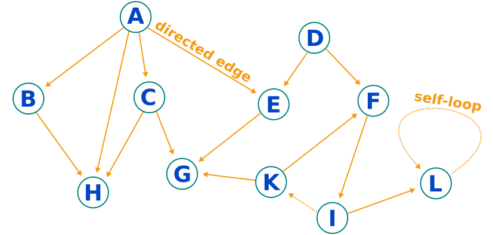

# Directed Graph

[](https://travis-ci.com/simphotonics/directed_graph)

## Introduction

An integral part of storing, manipulating, and retrieving numerical data are *data structures* or as they are called in Dart: *collections*.
Arguably the most common data structure is the list. It enables efficient storage and retrieval of sequential data that can be associated with an index.

A more general (non-linear) data structure where an element may be connected to one, several, or none of the other elements is called a **graph**.


Graphs are useful when keeping track of elements that are linked to or are dependent on other elements.
Examples include: network connections, links in a document pointing to other paragraphs or documents, foreign keys in a relational database, file dependencies in a build system, etc.

The package [directed_graph] contains a rudimentary implementation of a Dart graph that follows the recommendations found in [graphs-examples] and is compatible with
the algorithms provided by [graphs]. It is simple to use and includes methods that enable manipulating vertices and edges. The library provides access to algorithms
for the calculation of the *shortest path between vertices*, *detection of cycles*, or the *retrieval of a topological ordering of the graph vertices*.

## Terminology

Elements of a graph are called **vertices** (or nodes) and neighbouring vertices are connected by **edges**.
The figure below shows a **directed graph** with unidirectional edges depicted as arrows.
The edges are emanating from a vertex and ending at a vertex. A self-loop is an edge that is connecting a vertex to itself.



- **In-degree** of a vertex: Number of edges ending at this vertex. For example, vertex H has in-degree 3.
- **Out-degree** of a vertex: Number of edges starting at this vertex. For example, vertex F has out-degree 1.
- **Root**: A vertex with in-degree zero. Vertices A and D in the graph above are roots.
- **Edge**: A pair of vertices (vertex1, vertex2). The edge is starting at vertex1 and ends at vertex2.
- **Path**: One or more connected edges.
- **Cycle**: A path that starts and ends at the same vertex. For example, a self-loop is a cycle. The dashed edges in the figure indicate a cycle.
- **DAG**: An acronym for **Directed Acyclic Graph**, a directed graph without cycles.
- **Topological ordering**: An ordered list of all vertices in a graph such that vertex1 occurs before vertex2 if there is an edge pointing from vertex1 to vertex2.
A topological ordering of the graph above is: [A, D, B, C, E, K, F, G, H, I, L]. Hereby, we have disregarded dashed edges as a cyclic graph does
not have a topological ordering.

## Usage

To use this library include [directed_graph] as a dependency in your pubspec.yaml file. The
example below shows how to construct a graph. The constructor takes an optional edges map as parameter.

If a comparator is specified, vertices are sorted accordingly. For more information see [comparator].

Note: Several edges can be specified with one map entry. The key contains vertex1 where the edges start
and the value contains a list of vertices connected to vertex1 where the edges end.


```Dart
var red = Vertex<String>('red');
  var yellow = Vertex<String>('yellow');
  var orange = Vertex<String>('orange');
  var green = Vertex<String>('green');
  var blue = Vertex<String>('blue');
  var violet = Vertex<String>('violet');
  var gray = Vertex<String>('gray');
  var darkRed = Vertex<String>('darkRed');

  int comparator(
    Vertex<String> vertex1,
    Vertex<String> vertex2,
  ) {
    return vertex1.data.compareTo(vertex2.data);
  }

  var graph = DirectedGraph<String>(
    {
      orange: [red, yellow],
      green: [yellow, blue],
      violet: [red, blue],
      gray: [red, yellow, blue],
    },
    comparator: comparator,
  );

  // To add one or several edges use:
  graph.addEdges(red, [darkRed]);

  // To remove one or several edges use:
  graph.removeEdges(green, [blue]);

  // Access (sorted) vertices:
  // Note: This getter returns a non-modifiable list-view.
  var vertices = graph.vertices;

```

## Examples

For further information on how to generate a topological sorting of vertices see [example].

## Features and bugs

Please file feature requests and bugs at the [issue tracker].

[comparator]: https://api.flutter.dev/flutter/dart-core/Comparator.html
[issue tracker]: https://github.com/simphotonics/directed_graph/issues
[example]: example
[graphs-examples]: https://pub.dev/packages/graphs#-example-tab-
[graphs]: https://pub.dev/packages/graphs
[directed_graph]: https://pub.dev/packages/directed_graph
